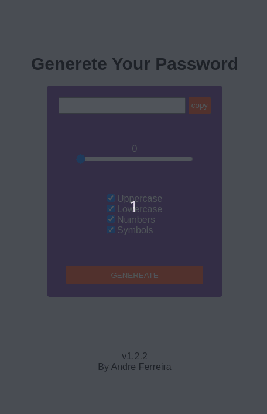

# Generate Password

    

## User stories

[x] User can select the length of the generated password.

[x] User can select one or multiple of the following: Include uppercase letters, Include lowercase letters, Include numbers, Include symbols.

[x] By clicking the Generate password button, the user can see a password being generated.

[x] User can click a Copy to clipboard button which will save the password to the clipboard.

[x] User can see the password strength